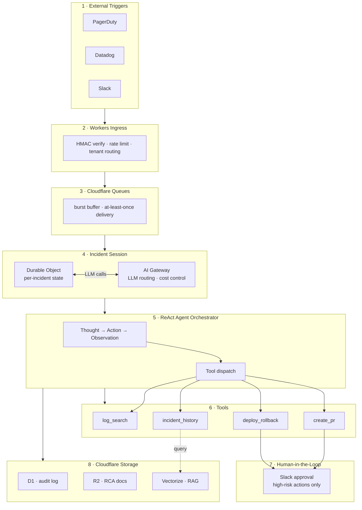

# Cloudflare SRE Incident Response Automation Agent

> **Production-grade Agentic AI system** that automates SRE incident response workflows — from alert ingestion through root cause analysis to mitigation — built entirely on Cloudflare's edge-native developer platform.

**MTTR target**: 47 min → 15 min | **Platform**: Cloudflare Workers + Durable Objects + D1 + Vectorize + AI Gateway

---

## What This Does

When a PagerDuty/Datadog alert fires at 3am, this agent:

1. **Ingests** the webhook at the edge (HMAC-verified, rate-limited)
2. **Triages** severity and impact via LLM reasoning
3. **Searches** logs (Datadog), metrics (CloudWatch), and similar past incidents (Vectorize RAG)
4. **Generates** a root cause hypothesis with confidence scoring
5. **Proposes** mitigation actions (rollback, PR, config change)
6. **Requests** human approval via Slack for high-risk actions
7. **Executes** approved actions (ArgoCD rollback, GitHub PR)
8. **Publishes** an auto-generated RCA document and updates Jira

All agent steps are immutably logged to D1 for audit and post-incident review.

## Architecture



## Cloudflare Products Used

| Product | Role |
|---------|------|
| **Workers** | Webhook ingress, agent orchestrator, tool executors |
| **Durable Objects** | Per-incident session state with strong consistency |
| **Queues** | Alert event buffering, backpressure handling |
| **D1** | Incident records, audit log, LLM cost tracking |
| **R2** | RCA documents, log snapshots |
| **KV** | Runbook cache, config, feature flags |
| **Vectorize** | Historical incident embeddings for RAG |
| **AI Gateway** | LLM routing, per-tenant cost budgets, audit logging |
| **Workers AI** | Default LLM (Llama 3.1 70B), embeddings (BGE Large) |

## Repository Structure

```
cloudflare-sre-agent/
├── src/
│   ├── index.ts                    # Workers entry point
│   ├── types.ts                    # Shared type definitions
│   ├── ingress/
│   │   ├── webhook.ts              # PagerDuty / Datadog / Slack webhook handlers
│   │   └── auth.ts                 # HMAC-SHA256 verification
│   ├── agents/
│   │   ├── incident-session.ts     # Durable Object — incident state management
│   │   ├── orchestrator.ts         # ReAct agent loop
│   │   └── queue-consumer.ts       # Queue batch processor
│   ├── tools/
│   │   ├── registry.ts             # Tool registry and dispatch
│   │   ├── datadog.ts              # Log search
│   │   ├── cloudwatch.ts           # Metrics query
│   │   ├── vectorize-search.ts     # Historical incident RAG
│   │   ├── github.ts               # PR creation
│   │   ├── argocd.ts               # Deployment rollback
│   │   ├── slack.ts                # Notifications + approval workflow
│   │   └── jira.ts                 # Ticket management
│   ├── llm/
│   │   ├── gateway.ts              # AI Gateway integration
│   │   └── prompts/                # System prompts (triage, RCA, mitigation)
│   ├── middleware/
│   │   ├── tenant.ts               # Multi-tenant isolation
│   │   └── pii-mask.ts             # PII detection and masking
│   ├── security/
│   │   └── prompt-guard.ts         # Prompt injection defense
│   └── db/
│       └── migrations/001_initial.sql
├── evals/
│   ├── scenarios/                  # Test incident scenarios (JSON)
│   └── run_eval.py                 # Eval runner (RCA F1 + MTTR measurement)
├── docs/
│   ├── architecture.md
│   ├── security-review.md
│   ├── runbook.md
│   └── adr/                        # Architecture Decision Records (5)
├── fixtures/
│   └── incidents/                  # Mock PagerDuty/Datadog payloads
├── .github/
│   └── workflows/
│       ├── deploy.yml              # CI/CD: test → staging → production
│       └── eval.yml                # Weekly automated eval run
├── .env.example                    # Environment variable template (no real values)
├── wrangler.toml                   # CF Workers config (no secrets)
└── LICENSE                         # Apache 2.0
```

## Getting Started

### Prerequisites

- [Cloudflare account](https://dash.cloudflare.com/sign-up) (free tier works for development)
- [Wrangler CLI](https://developers.cloudflare.com/workers/wrangler/install-and-update/) v3.80+
- Node.js 20+

### Local Development

```bash
git clone https://github.com/liks79/agentic-lab-cloudflare.git
cd cloudflare-sre-agent
npm install

# Copy env template — fill in your values
cp .env.example .dev.vars
# Edit .dev.vars with your API keys (never commit this file)

# Set up D1 locally
npm run db:migrate:local

# Start local dev server
npm run dev
```

### Test with Mock Incident

```bash
# Send a mock PagerDuty P1 alert
curl -X POST http://localhost:8787/webhook/pagerduty \
  -H "Content-Type: application/json" \
  -H "X-PagerDuty-Signature: v1=<computed_hmac>" \
  -d @fixtures/incidents/pagerduty-p1.json
```

### Deploy to Cloudflare

```bash
# Create Cloudflare resources (one-time)
wrangler d1 create sre-agent-db
wrangler kv namespace create CONFIG_KV
wrangler r2 bucket create sre-agent-incident-docs
wrangler queues create sre-agent-incidents
npm run vectorize:create
# → copy IDs to wrangler.toml

# Set secrets (never put in wrangler.toml)
wrangler secret put ANTHROPIC_API_KEY
wrangler secret put PAGERDUTY_WEBHOOK_SECRET
# ... (see docs/runbook.md for full list)

# Deploy
npm run deploy
```

See [docs/runbook.md](docs/runbook.md) for complete setup instructions.

## Security

- All webhook signatures verified via HMAC-SHA256 (WebCrypto API)
- External API credentials stored as Workers Secrets (AES-256 encrypted)
- PII masking applied to all log content before LLM processing
- Prompt injection defense with boundary tags + pattern detection
- All destructive actions require human approval via Slack
- Multi-tenant isolation: Durable Object namespacing + D1 row-level filtering
- Full security assessment: [docs/security-review.md](docs/security-review.md)

**Never commit**: `.dev.vars`, `.env`, or any file containing real credentials.

## Eval Results (Synthetic Scenarios)

| Metric | Value |
|--------|-------|
| RCA F1 Score (avg) | TBD after full scenario suite |
| Avg MTTR (P1) | TBD after eval run |
| Scenarios passing | TBD |

Run evals yourself:
```bash
EVAL_API_KEY=<your-key> python evals/run_eval.py --env staging
```

## Architecture Decision Records

- [ADR-001](docs/adr/001-durable-objects-vs-redis.md): Durable Objects vs Redis for session state
- [ADR-002](docs/adr/002-ai-gateway-model-routing.md): AI Gateway for LLM routing
- [ADR-003](docs/adr/003-react-agent-pattern.md): ReAct pattern for agent orchestration
- [ADR-004](docs/adr/004-vectorize-rag.md): Vectorize for historical incident RAG
- [ADR-005](docs/adr/005-human-in-the-loop.md): Human-in-the-loop for destructive actions

## License

Apache 2.0 — see [LICENSE](LICENSE)

---

*Built as part of a Cloudflare FDE portfolio — demonstrating production-grade Agentic AI system design on the Cloudflare Developer Platform.*
