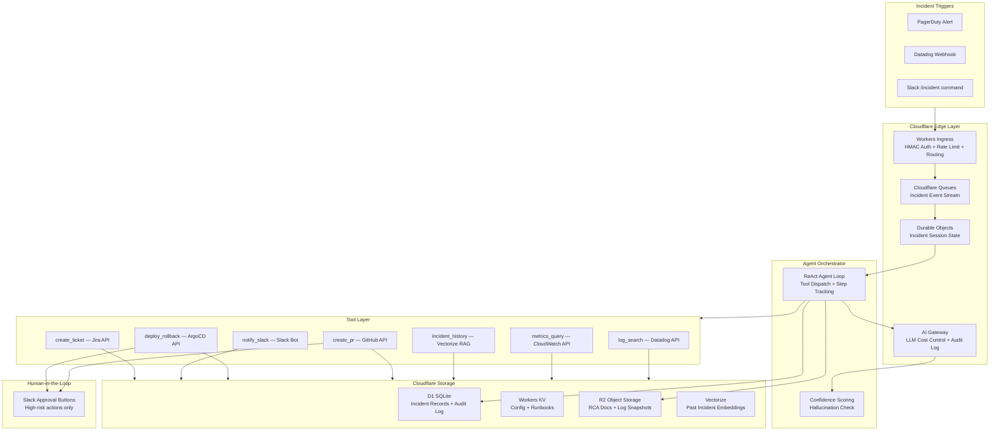

# Architecture: SRE Incident Response Automation Agent

## Overview

This system automates the SRE incident response workflow — from alert ingestion through root cause analysis to mitigation — using Cloudflare's edge-native developer platform.

**Target reduction**: MTTR from 47 minutes → under 15 minutes across P1/P2 incidents.

## System Diagram



## Component Decisions

### Why Durable Objects for session state?

Incident sessions require **strong consistency** — multiple concurrent tool calls must observe the same step history without race conditions. DOs provide a single-threaded JavaScript execution context with ACID guarantees, eliminating distributed lock complexity. Redis/Upstash alternatives would require TTL management and introduce network round-trips.

### Why AI Gateway for LLM routing?

AI Gateway provides:
- Per-request prompt/response audit logging → R2 archive (compliance requirement)
- Per-tenant token budget enforcement ($500/month cap)
- Automatic model fallback: Workers AI (Llama 3.1 70B) → Claude Sonnet (complex reasoning)
- Cost visibility without custom instrumentation

### Why Vectorize for RAG?

Vectorize is a zero-network-hop binding from Workers, enabling sub-10ms similarity searches. Alternative: Pinecone requires an external HTTP call, adding 50-150ms latency and network egress cost. At portfolio scale (200+ incident embeddings), Vectorize free tier covers the use case entirely.

### Why Cloudflare Queues?

PagerDuty/Datadog can burst during cascading failures (100+ alerts/minute). Queues buffer this load with at-least-once delivery, preventing Workers from becoming a bottleneck. Dead-letter queue handles permanent failures without data loss.

## Security Model

See [security-review.md](./security-review.md) for full details.

| Boundary | Control |
|----------|---------|
| External webhooks | HMAC-SHA256 signature verification |
| Tenant data isolation | DO namespace + D1 row-level filtering by `tenant_id` |
| LLM prompt injection | `<external_data>` boundary tags + input sanitization |
| PII in logs | Regex-based masking before LLM/storage |
| High-risk actions | Mandatory Slack approval workflow |
| Secrets | Workers Secrets (encrypted at rest, never in code) |

## Data Flow

```
PagerDuty → Workers (HMAC verify) → Queue → Durable Object
→ ReAct Loop:
    Step 1: log_search(Datadog) → mask PII → observe
    Step 2: incident_history(Vectorize) → observe  
    Step 3: RCA generation (AI Gateway → Workers AI / Claude)
    → if confidence ≥ 0.85: send to Slack for approval
    → if confidence < 0.85: escalate to on-call
→ Human approves → deploy_rollback(ArgoCD) / create_pr(GitHub)
→ Post-incident: RCA → R2, embed → Vectorize, update D1
```

## Performance Targets

| Metric | Target | Mechanism |
|--------|--------|-----------|
| Webhook ingest latency | < 100ms | Workers edge, HMAC verify in-process |
| Agent step latency (per step) | < 3s | Workers AI P99 + tool timeout 5s |
| End-to-end MTTR (P1) | < 15min | ReAct loop max 10 steps |
| Vectorize search | < 20ms | Zero-hop binding |
| DO write | < 10ms | Single-region strong consistency |
